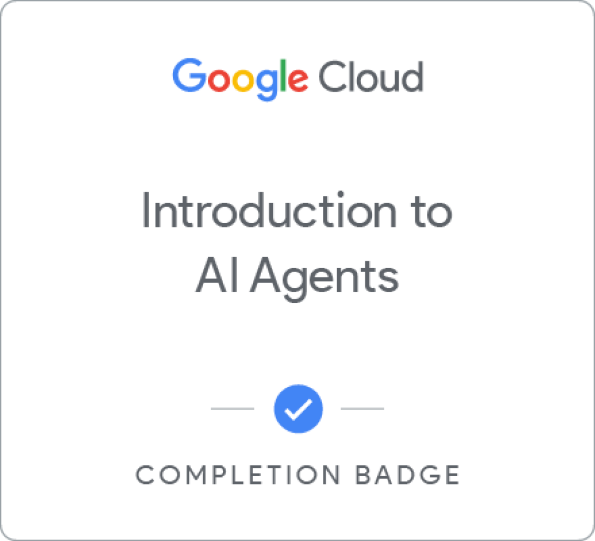
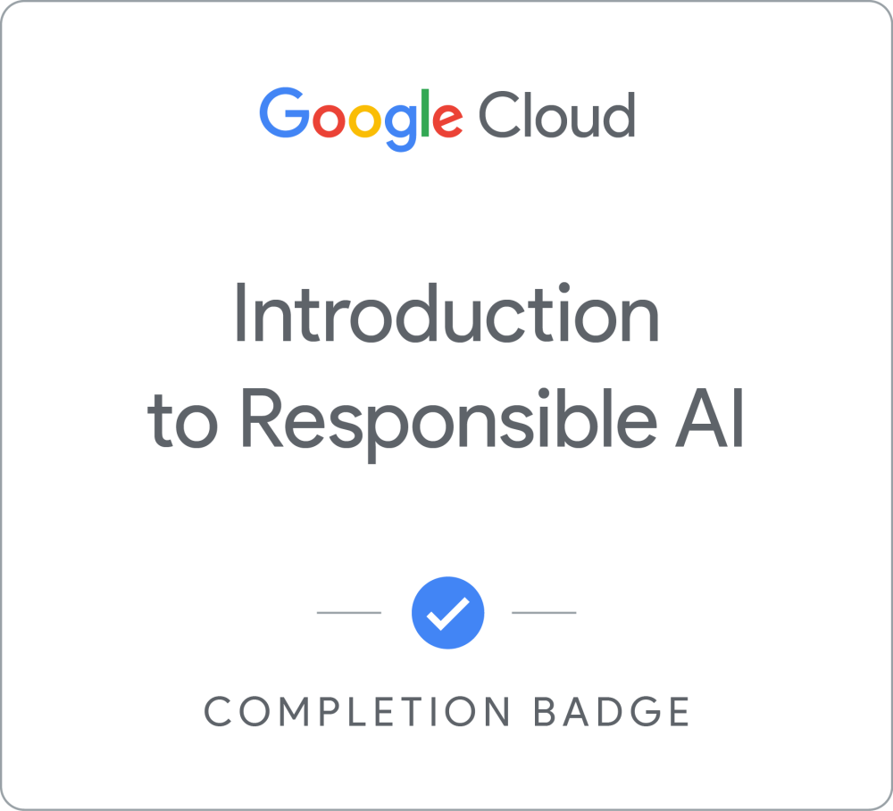

<!-- ====== ANIMATED HEADER BANNER ====== -->

<!-- ====== TYPING ANIMATION ====== -->

<!-- ====== PROFILE VIEWS + FOLLOW + SOCIALS ====== -->

<!-- TODO: replace the # below with your real profile links -->

---

## 🚀 About me

I'm a **full-stack developer** based in Pakistan, building products at **Gaditek**. I care deeply about writing clean, purposeful code — and equally about using technology to lift others up.

- 🔭 Currently building full-stack web apps with **React + Node.js**
- 🌱 Always learning — currently exploring AI tooling & cloud
- 👩‍💻 **Women Techmakers Ambassador Candidate** & community builder
- 💬 Ask me about **frontend, React, mentorship & women in tech**
- ⚡ Fun fact: I believe the best code is the kind that makes room for more voices

 

---

## 🛠️ Tech Stack

### Frontend

### Backend & AI

---

## 📊 GitHub Stats

---

## 🏆 Certifications & Achievements

| Certificate | Issuer | Focus |
|:-----------|:-------|:------|
| 🤖 **Claude AI Certification** | Anthropic | AI fundamentals & prompt engineering |
| ☁️ **[Google Cloud Skills Profile »](https://www.skills.google/public_profiles/cfa48632-1a2a-472a-aa92-27aefb38df9d)** | Google | Cloud computing & infrastructure |
| 🏆 **14-Day Coding Challenge** | Women Who Code | Consistent practice & problem solving |
| 👩‍💻 **Community Session** | Tech Sisters | Women in tech, community & leadership |

> 💡 

---

## 💡 Featured Projects

| Project | What it does |
|:--------|:-------------|
| 💰 [budget-app](https://github.com/ALEEZAJOGIYAT/budget-app) | Personal finance tracking app |
| 🤖 [multi-agent-sdk-comparison](https://github.com/ALEEZAJOGIYAT/multi-agent-sdk-comparison) | Comparison of multi-agent AI SDKs & frameworks |
| 🎓 [campus-recruitment](https://github.com/ALEEZAJOGIYAT/campus-recruitment) | Campus recruitment & hiring platform |

---

<!-- ====== SNAKE CONTRIBUTION ANIMATION ====== -->

### 🐍 Watch my contributions get eaten

---

### 💜 "The best communities are built on knowledge-sharing, mentorship, and making room for more voices in tech."

